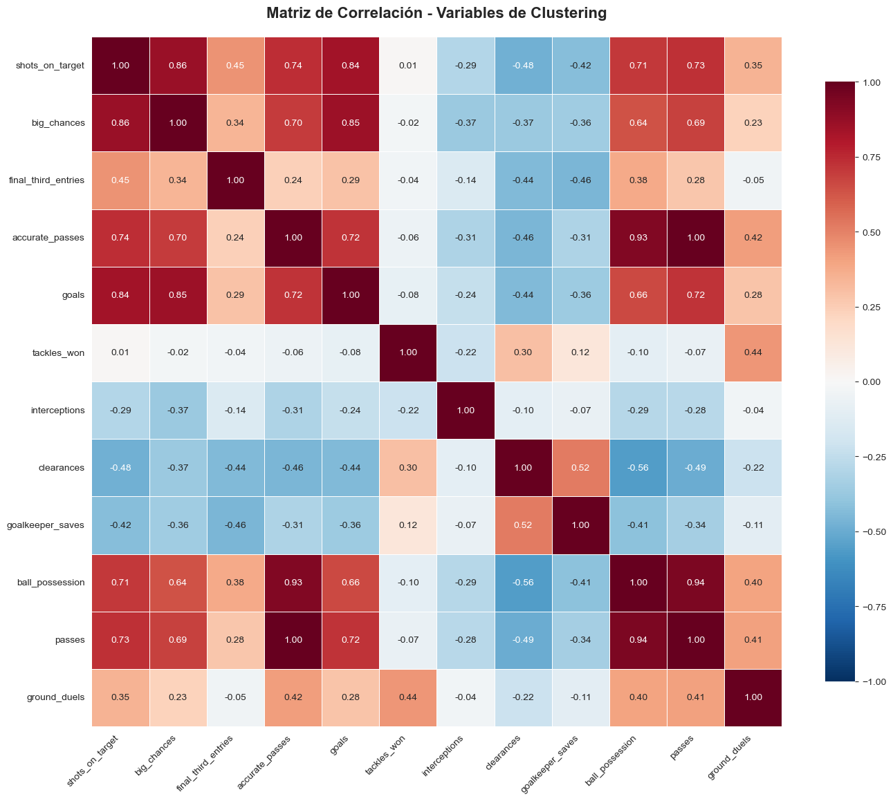
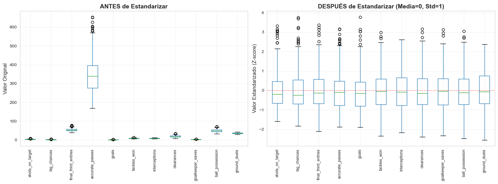
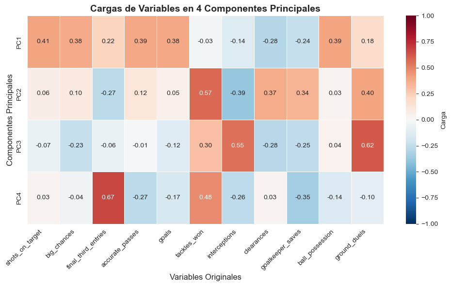
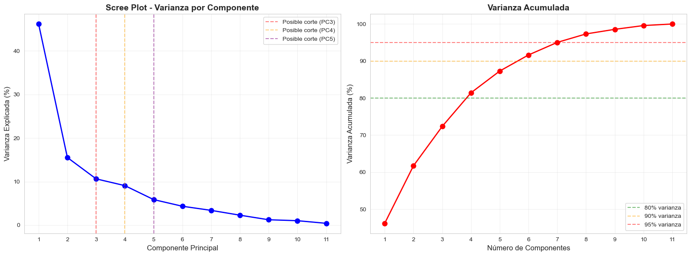
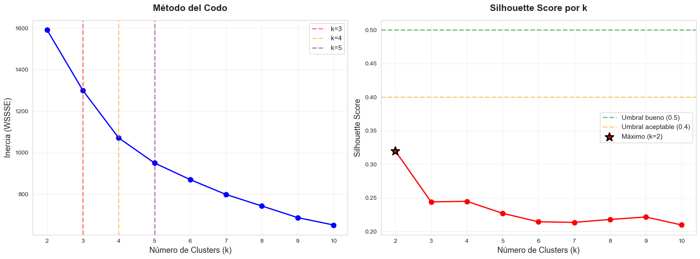
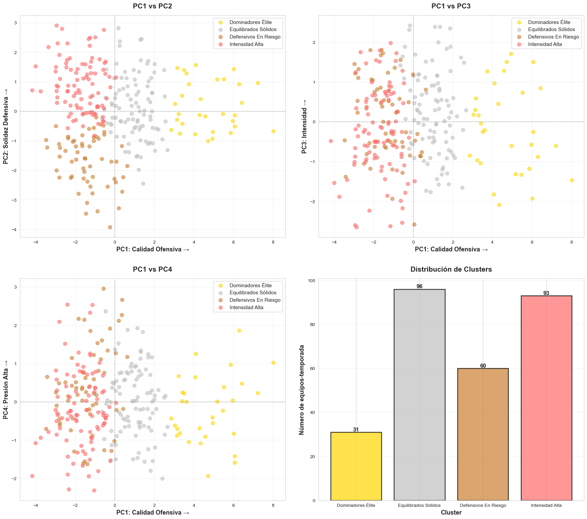
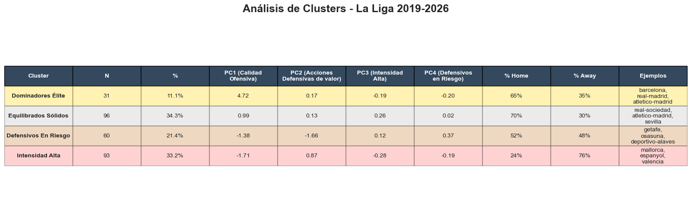

# La Liga Clustering

En este repositorio analizaremos como los equipos de LaLiga durante las temporadas (2019-2026) pueden clasificarse en diferentes grupos gracias a utilizar algoritmos de Machine Learning avanzado (Clustering, PCA, reducción de la dimensionalidad).

## 1. Configuración inicial

Existe un fichero llamado `mainconfig_secret.ini`, no subido a git, el cual contiene la información de la base de datos, usuario, contraseñas, tablas, etc. Para más información contactar con el responsable del proyecto: **rodrigobg1304**.

Las principales librerías que se deben instalar para el correcto funcionamiento de este notebook son:

- Pandas
- Numpy
- PySpark
- Scikit-learn
- Plotly


## 2. Análisis

📊 **EL RETO**: Más allá de puntos y goles para entender una clasificación: ¿existen perfiles tácticos diferenciados? 

**Hipótesis**: El rendimiento de un equipo se puede predecir por su estilo de juego.

Tras el análisis inicial de los datos almacenados en la base de datos, se ha decidido utilizar 12 características para analizar el comportamiento de los equipos de fútbol, las estadísticas analizadas se agrupan en 4 grupos:

1. Ofensivas
2. Defensivas
3. Control de juego
4. Resultado

Todas ellas tienen un número suficientemente alto de registros como para sacar buenas conclusiones tras el análisis, es importante tener en cuenta el rendimiento de los equipos basados en su juego como local o visitante, ya que el estilo de juego de algunos equipos podría variar.

### 2.1. Exploración de los datos

Tras el analizar las primeras 12 variables ya que son las más explicativas para el proyecto que estamos desarrollando, deberíamos de revisar si existe alguna correlación entre ellas.



Se identifica las variables redundantes como `passes` y `accurate_passes` con una correlación de 0.996, en la imagen se muestra como 1.00. Por lo tanto no tiene sentido incluir ambas variables, nos quedaremos con accurate_passes de aquí en adelante. 

Otras relaciones que están bastante relacionadas son las siguientes:

```markdown
=== CORRELACIONES ALTAS (|r| > 0.80) ===
  shots_on_target <-> big_chances: 0.862
  shots_on_target <-> goals: 0.844
  big_chances <-> goals: 0.853
  accurate_passes <-> ball_possession: 0.930
  accurate_passes <-> passes: 0.996
  ball_possession <-> passes: 0.943
  
🎯 TOP 5 variables más correlacionadas con variable Goals:
  big_chances: 0.853
  shots_on_target: 0.844
  accurate_passes: 0.723
  passes: 0.719
  ball_possession: 0.659
```

Una vez eliminada la variable de passes tenemos que proceder a la estandarización de los datos, tenemos datos como la precisión en el pase, posesión del balón que tiene valores muy elevados en comparación con los goles o paradas de los porteros, para que todas las features trabajen en la misma dimensión.



### 2.2. Reduccion de la dimensionalidad (PCA)

Aún así seguimos teniendo muchas variables, por ello es necesario aplicar una reducción de la dimensionalidad, aplicando Principal Component Analysis (PCA) en cada componente tenemos una combinación lineal de las variables originales maximizando la información retenida.



Con PCA transformamos las 11 features en 4 componentes principales ortogonales (independientes entre sí), reduciendo la dimensionalidad mientras se preserva el 82% de la información original. 

```
ANTES (11 features)                  DESPUÉS (4 componentes)
━━━━━━━━━━━━━━━━━                    ━━━━━━━━━━━━━━━━━━━━━

shots_on_target  ─┐
big_chances      ─┤
goals            ─┼─→ PC1: Calidad Ofensiva (45%)
accurate_passes  ─┤
ball_possession  ─┘

tackles_won      ─┐
interceptions    ─┼─→ PC2: Solidez Defensiva (16%)
clearances       ─┤
goalkeeper_saves ─┘

ground_duels     ─┬─→ PC3: Intensidad (11%)
interceptions    ─┘

final_third_entries ─┬─→ PC4: Presión Alta (9%)
tackles_won         ─┘
```

| **Componente** | **Varianza** | **Interpretación** | **Variables principales**                            |
| -------------- | ------------ | ------------------ | ---------------------------------------------------- |
| PC1            | 45%          | Calidad Ofensiva   | shots_on_target, big_chances, goals, accurate_passes |
| PC2            | 16%          | Solidez Defensiva  | tackles_won, interceptions, clearances               |
| PC3            | 11%          | Intensidad Física  | ground_duels, interceptions                          |
| PC4            | 9%           | Presión Alta       | final_third_entries, tackles_won                     |

**Resultado:** Explicando un 81,43% de la varianza.

- **PC1** (45% varianza): Calidad Ofensiva 
- **PC2** (16% varianza): Solidez Defensiva 
- **PC3** (11% varianza): Intensidad Física 
- **PC4** (9% varianza): Presión Alta



Una vez identificados los 4 clusters se ha procedido a evaluar el número óptimo de clusters con el método del codo + Silhoutte Score, la recomendación indicada es la siguiente:

**🎯 RECOMENDACIÓN DE K ÓPTIMO**

📊 Según Silhouette Score máximo:
   k = 2 (score: 0.320)

📉 Según Método del Codo (segunda derivada):
   k ≈ 5



### 2.3. Conclusiones

Sin embargo, hemos decidido optar por 4 clusters, cómo previamente habíamos visto, considerando el equilibrio entre complejidad (más clusters) e interpretabilidad.

Con la ayuda plotly se han construido gráficos interactivos desde el propio Jupyter para analizar los equipos en función de los componentes previamente descritos.



| **Dominadores Élite (11%)**                         | **Equilibrados Sólidos (34%)**                   | **Defensivos En Riesgo (21%)**                | **Intensidad Alta (33%)**      |
| --------------------------------------------------- | ------------------------------------------------ | --------------------------------------------- | ------------------------------ |
| Alta calidad ofensiva (PC1: +4.7)                   | Rendimiento balanceado en todos los componentes. | Mucha actividad defensiva, poca ofensiva.     | Presión alta constante         |
| No necesitan defender, llevan el control del juego. | Mitad de tabla hacia arriba.                     | Equipos posible descenso o muy débiles fuera. | Mayoría son equipos visitantes |
| Ejemplos: Barcelona/Madrid.                         | Ejemplo: Real Sociedad, Betis en casa.           | Ejemplo: Equipos potenciales a descender.     | Ejemplo: Rayo Vallecano.       |

**💡 INSIGHTS CLAVE** 

🏟️ El factor LOCAL/VISITANTE es CRÍTICO: 

- 65% de "Dominadores Élite" juegan en casa, mayor dominio de equipos locales.
- 30% de "Equilibrados Sólidos" mantienen su estilo lejos de casa, los equipos bajan su rendimiento al jugar de visitantes.


